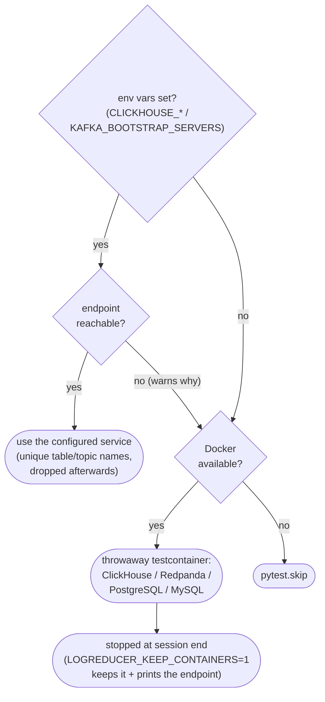

# Contributing to logreducer

Thanks for your interest in improving logreducer.

## Development setup

logreducer uses [uv](https://docs.astral.sh/uv/) for dependency management.

```bash
git clone https://github.com/hyperi-io/logreducer.git
cd logreducer
uv sync --all-extras   # core + ALL extras (enhanced/sql/clickhouse/kafka) + the dev group
```

## Running the checks

There is no Makefile - the canonical local gate is the same one CI runs:

```bash
hyperi-ci check          # full local gate: lint, types, security, tests
```

Or run the tools individually:

```bash
uv run ruff format             # format
uv run ruff check --fix        # lint (autofix)
uv run mypy src/logreducer     # strict type check
uv run ty check src/logreducer # Astral type check
uv run pytest -q               # tests
uv build                       # build wheel + sdist
```

## Tests

- `tests/unit/` - fast, server-free (real SQLite, real corpora, no mocks of
  internal code). `tests/integration/` - marked `integration`, run against
  real services. `tests/testdata/` holds gzipped, PII-cleansed slices of REAL
  public log datasets (see its README for provenance and the rebuild tool).
- Integration tests find their services env-first, then docker, then skip:



- Copy `.env.example` to `.env` to point tests at existing services. CI sets
  no env vars, so it always takes the docker path.
- Every test that touches a shared service creates uniquely-named tables and
  topics and cleans them up, so runs never collide.

## Commit messages

We use [Conventional Commits](https://www.conventionalcommits.org/). Keep the
subject to 50 characters or fewer. Common types: `fix`, `feat`, `docs`,
`refactor`, `perf`, `test`, `chore`, `ci`, `build`.

Versioning and releases are automated - do NOT hand-edit the version.
semantic-release derives the next version from the commit history, then tags,
builds and publishes. Just land well-formed commits on a feature branch and
open a pull request to `main`.

## Pull requests

1. Branch from `main` (e.g. `fix/memory-leak`, `feat/clickhouse-source`).
2. Make your change with tests; keep `hyperi-ci check` green.
3. Open a pull request to `main`.

## Code style

- Python 3.12+, [ruff](https://docs.astral.sh/ruff/) formatted (line length 120).
- Fully typed - `mypy` runs strict; annotate new code.
- Australian English in prose; ASCII-only in comments, commit messages and docs.
