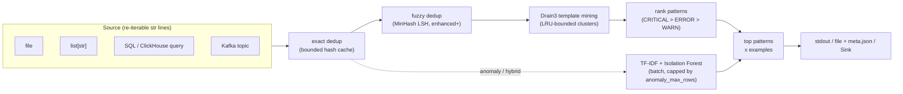
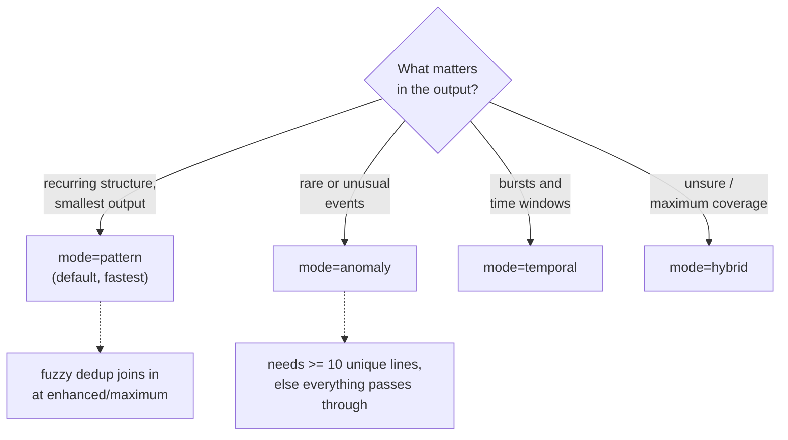
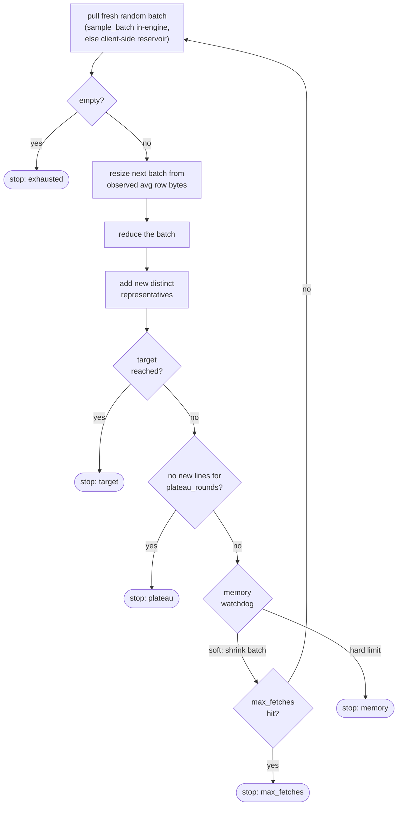
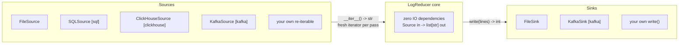

# LogReducer

[](https://pypi.org/project/logreducer/)
[](https://www.python.org/)
[](LICENSE)

Reduce gigabytes of logs to a small, representative sample - keeping the patterns and anomalies that matter and dropping the repetition that does not. Memory-safe streaming, temporal awareness, and ML-based anomaly detection.

**LogReducer is two tools in one package:**

- **A CLI you can use right now.** `logreducer app.log` reduces a file - or a SQL, ClickHouse, or Kafka source - straight from the shell. No code to write.
- **A library with an IO-agnostic core.** The engine has zero IO dependencies and reduces any re-iterable stream of `str` lines (a `Source`). Embed it in your own pipeline; the engine never manages the connection.

## Features

- **Memory-safe streaming**: near-constant memory on multi-GB inputs; low, container-friendly defaults
- **Four reduction modes**: pattern (Drain3), anomaly (Isolation Forest), temporal, and hybrid
- **IO-agnostic core**: reduce a file, a `list[str]`, a database cursor, or a Kafka stream through one `Source` seam
- **Optional adapters**: SQL (SQLAlchemy), ClickHouse (clickhouse-connect), Kafka (confluent-kafka) - install only what you use
- **Engine-side sampling**: seeded, dialect-aware SQL sampling and native `TABLESAMPLE` for cheap reduction of huge tables
- **Embeddable**: injection seams for a host application's own config cascade and logging standard

## Installation

### As a CLI tool

Install it as an isolated tool so its dependencies never clash with your other Python projects (needs Python 3.12+):

```bash
uv tool install logreducer     # recommended (uv)
# or
pipx install logreducer        # recommended (pipx)
```

To bundle an adapter extra with the tool: `uv tool install "logreducer[clickhouse]"`.

### As a library

```bash
uv add logreducer
# or
pip install logreducer
```

Optional extras (install only what you need):

```bash
uv add "logreducer[enhanced]"    # fuzzy dedup, faster hashing
uv add "logreducer[sql]"         # SQLSource (SQLAlchemy) - bring your own DBAPI driver
uv add "logreducer[clickhouse]"  # ClickHouseSource (clickhouse-connect)
uv add "logreducer[kafka]"       # KafkaSource / KafkaSink (confluent-kafka)
```

> The `logreducer` command works under any install method (project venv, `pip install --user`, pipx/uv tool, system-wide). `pipx` / `uv tool` is the recommendation for end users - isolation without a manual venv.

## Quick Start

### Command line

```bash
# Reduce a file to stdout, or to a file with -o
logreducer app.log
logreducer app.log -o reduced.log -l enhanced -m hybrid

# JSON output, with run stats on stderr
logreducer app.log --format json -o result.json --stats

# Cap memory, estimate first
logreducer huge.log --max-memory 2 --estimate
```

### Library

```python
from logreducer import LogReducer

reducer = LogReducer(level="standard")

# Reduce a file (writes reduced.log + reduced.meta.json)
reduced = reducer.process_file("app.log", output_file="reduced.log")
print(f"{len(reduced)} representative lines")

# Reduce any re-iterable of lines - no file needed
lines = ["ERROR timeout upstream=payments", "INFO ok", "ERROR timeout upstream=payments"]
reduced = reducer.reduce(lines)
```

`reduce()` returns the reduced lines in memory. Pass `return_metadata=True` for a dict of `{"lines", "stats", "config"}`.

## How it works

Everything streams: lines flow through dedup and template mining as one generator pipeline, so the unique-line set is never materialised. Memory stays near-constant regardless of input size.



The anomaly branch is the one part that cannot stream (Isolation Forest is batch ML); cap its input with `anomaly_max_rows` when reducing very high-cardinality sources.

## Choosing a mode and level



| Mode | Description | Best for |
|------|-------------|----------|
| `pattern` | Drain3 template mining | Structured / application logs (fastest) |
| `anomaly` | Isolation Forest outlier detection | Security and error logs |
| `temporal` | Time-aware pattern analysis | Time-series and monitoring logs |
| `hybrid` | Pattern + anomaly combined | Maximum coverage |

| Level | Speed | Memory cap | Features |
|-------|-------|-----------|----------|
| `standard` | Fast | 0.5 GB | Deduplication + pattern extraction |
| `enhanced` | Moderate | 1 GB | + fuzzy dedup |
| `maximum` | Thorough | 2 GB | + wider pattern budget |

## Reducing from a database or Kafka

The CLI dispatches on the `--dsn` scheme; a library caller constructs the source directly.

```bash
# PostgreSQL / MySQL / SQLite via SQLAlchemy (needs logreducer[sql] + a driver)
logreducer --dsn postgresql://user@host/db --query "SELECT message FROM logs"

# ClickHouse via the native driver (needs logreducer[clickhouse])
logreducer --dsn clickhouse://user@host:8123/db --query "SELECT message FROM logs"

# Kafka topic (needs logreducer[kafka])
logreducer --dsn kafka://broker:9092 --topic app-logs --group logreducer
```

```python
from logreducer import LogReducer
from logreducer.clickhouse import ClickHouseSource

reducer = LogReducer(level="enhanced", mode="hybrid")
with ClickHouseSource("clickhouse://user@host:8123/db", "SELECT message FROM logs") as source:
    reduced = reducer.reduce(source)
```

The query selects the log line as its **first column**. Sources are re-iterable (the engine makes multiple passes), so a database source re-runs its query per pass and a Kafka source re-reads from the earliest offset without committing.

## Sampling large sources

For a table too large to scan in full, sample a fraction of rows. SQL sampling is deterministic when you pass a seed (so the reducer's multi-pass modes see a stable input); ClickHouse uses its native `SAMPLE` clause.

```python
from logreducer.sql import SQLSource

# Wrap any query in a seeded random predicate (PostgreSQL/MySQL)
source = SQLSource("postgresql://user@host/db", "SELECT msg FROM logs", sample=0.01, sample_seed=42)

# Or sample a TABLE with the engine's native sampler - PostgreSQL
# TABLESAMPLE SYSTEM is page-level and genuinely sub-linear:
source = SQLSource.from_table("postgresql://user@host/db", "logs", "msg", sample=0.01, sample_seed=42)
```

```bash
logreducer --dsn postgresql://user@host/db --query "SELECT msg FROM logs" --sample 0.01 --sample-seed 42
```

Notes: SQLite has no seedable RNG, so a seeded sample raises `SamplingNotSupported` (unseeded, best-effort sampling still works). ClickHouse `SAMPLE` needs the table to declare a `SAMPLE BY` key. For an arbitrary complex query, put the sampling clause in your own SQL instead.

## Collecting a target number of lines

When you want *about N* representative lines rather than "reduce everything", `reduce_to_target` pulls fresh random batches and reduces each, accumulating distinct representatives until a stop condition fires. Peak memory is bounded to roughly one batch plus the accumulator.



```python
from logreducer import LogReducer, reduce_to_target
from logreducer.sql import SQLSource

reducer = LogReducer(level="enhanced", mode="hybrid")
source = SQLSource("postgresql://user@host/db", "SELECT msg FROM logs")
outcome = reduce_to_target(source, reducer, target_rows=5000, max_batch_memory_gb=1.0)
print(outcome["stats"]["stop_reason"])   # target / exhausted / max_fetches / plateau / memory
lines = outcome["lines"]
```

```bash
logreducer --dsn postgresql://user@host/db --query "SELECT msg FROM logs" \
    --target-rows 5000 --max-fetches 50 --max-batch-memory 1.0
```

## Bounding memory

The core streams, so pattern/temporal modes run in near-constant memory. The knobs:

- `max_memory_gb` - the overall cap (also sizes file read strategy and the watchdog). Presets: 0.5 / 1 / 2 GB by level; values above 70% of available RAM are clamped with a warning.
- `max_clusters` - LRU-bound the Drain3 template store (unbounded by default).
- `anomaly_max_rows` - reservoir-cap the rows fed to anomaly detection (off by default; trades anomaly recall for a bounded matrix).

```python
reducer = LogReducer(level="enhanced", mode="hybrid", max_clusters=50_000, anomaly_max_rows=200_000)
```

## Sources and sinks

The engine is built around two tiny structural protocols - that is the whole integration surface:



An application can hand the reducer its own IO - anything that yields `str` and can be iterated more than once is a `Source`:

```python
class MySource:
    def __iter__(self):
        yield from open_my_stream()  # must return a FRESH iterator each call

reducer.reduce(MySource())
```

Output works the same way through a `Sink` (`write(lines) -> int`):

```python
from logreducer import LogReducer, FileSink

reducer.reduce(source, sink=FileSink("reduced.jsonl", output_format="jsonl"))
```

## Embedding in a host application

A host app that owns its own config cascade and logging standard drives logreducer with three seams - no logreducer-side knowledge of the host required:

```python
import logreducer

# 1. Config: build it from YOUR cascade and inject it (kwargs still win on top)...
cfg = logreducer.BigDialConfig(max_memory_gb=0.5, max_patterns=800)
reducer = logreducer.LogReducer(mode="hybrid", config=cfg)

# ...or let logreducer read your env cascade directly: prefixed beats bare.
cfg = logreducer.BigDialConfig.from_env("MYAPP", "LOGREDUCER")   # MYAPP_MAX_MEMORY_GB wins

# 2. Logging: your app owns the loguru sinks; logreducer registers nothing and
#    its records flow through YOUR handlers, formatted by YOUR standard.
logreducer.setup_logging(enable=True, own_sinks=False)
```

## Configuration

Override any config field as a keyword argument (unknown names raise - typos never silently no-op):

```python
reducer = LogReducer(
    level="enhanced",
    mode="hybrid",
    max_memory_gb=1.0,          # memory ceiling (clamped to 70% of available RAM)
    dedup_cache_size=100000,    # bounded dedup cache
    drain_similarity=0.4,       # pattern similarity threshold
    fuzzy_threshold=0.8,        # fuzzy-dedup threshold (enhanced/maximum)
    anomaly_contamination=0.1,  # expected anomaly fraction
    temporal_window_minutes=60, # grouping window for temporal mode
    max_patterns=2000,          # cap on extracted patterns
)
```

## Logging

Logging is off by default. Enable it and pick a format via env vars:

```bash
LOG_LEVEL=DEBUG LOG_FORMAT=json logreducer app.log --log
```

`LOG_FORMAT=json` emits one JSON object per line for log aggregators; the default is human-readable (coloured in a terminal, plain in CI/containers). Embedding? See `own_sinks=False` above.

## Development

```bash
git clone https://github.com/hyperi-io/logreducer.git
cd logreducer
uv sync --all-extras
```

See [CONTRIBUTING.md](CONTRIBUTING.md) for the toolchain, test layout (including the real-log corpora under `tests/testdata/`) and how the integration tests find their services.

## License

[Apache-2.0](LICENSE). Third-party attributions are recorded in [NOTICE](NOTICE).

Copyright 2026 HYPERI PTY LIMITED.
