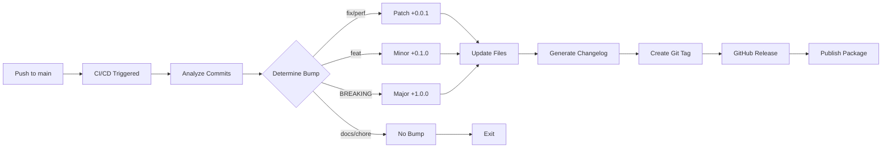

# Automated Versioning & Release Guide

## Why Automated Versioning?

Traditional manual versioning is error-prone and time-consuming:
- Developers forget to bump versions
- Version numbers become inconsistent across files
- Changelog updates are missed
- Releases lack standardization

**This project uses fully automated semantic versioning** that:
- **Zero manual work** - versions update automatically
- **Self-documenting** - commits become your changelog
- **Consistent** - follows industry-standard semver rules
- 🔄 **Predictable** - team knows what triggers releases
- 📦 **Professional** - generates releases, tags, and notes automatically

## How It Works

### The Magic: Conventional Commits → Automatic Versions

When you write commits using a specific format, our CI/CD pipeline automatically:
1. **Reads** your commit messages
2. **Determines** the appropriate version bump
3. **Updates** all version files
4. **Generates** changelog entries
5. **Creates** GitHub releases and tags
6. **Publishes** packages (if configured)

### Commit Format

```
<type>[optional scope]: <description>

[optional body]

[optional footer(s)]
```

## Version Bump Rules

| Commit Type | When to Use | Version Impact | Example Version Change |
|------------|-------------|----------------|----------------------|
| `fix:` | Bug fixes | **Patch** (+0.0.1) | 1.2.3 → 1.2.4 |
| `feat:` | New features | **Minor** (+0.1.0) | 1.2.3 → 1.3.0 |
| `feat!:` or `BREAKING CHANGE:` | Breaking changes | **Major** (+1.0.0) | 1.2.3 → 2.0.0 |
| `docs:` | Documentation only | No bump | 1.2.3 → 1.2.3 |
| `chore:` | Maintenance tasks | No bump | 1.2.3 → 1.2.3 |
| `style:` | Code formatting | No bump | 1.2.3 → 1.2.3 |
| `refactor:` | Code restructuring | No bump | 1.2.3 → 1.2.3 |
| `test:` | Adding tests | No bump | 1.2.3 → 1.2.3 |
| `perf:` | Performance improvements | **Patch** (+0.0.1) | 1.2.3 → 1.2.4 |
| `ci:` | CI/CD changes | No bump | 1.2.3 → 1.2.3 |
| `build:` | Build system changes | No bump | 1.2.3 → 1.2.3 |

## Real-World Examples

### Bug Fix (Patch Bump: 1.0.0 → 1.0.1)
```bash
git commit -m "fix: resolve memory leak in log processing

The streaming processor was not releasing buffers correctly,
causing memory to grow unbounded on large files."
```

### ✨ New Feature (Minor Bump: 1.0.1 → 1.1.0)
```bash
git commit -m "feat: add JSON export format for processed logs

Users can now export results as JSON using --format json flag.
This enables integration with external tools and APIs."
```

### 💥 Breaking Change (Major Bump: 1.1.0 → 2.0.0)

**Method 1: Using exclamation mark**
```bash
git commit -m "feat!: change LogReducer API to async/await pattern"
```

**Method 2: Using BREAKING CHANGE footer**
```bash
git commit -m "feat: redesign configuration system

BREAKING CHANGE: Config files now use YAML instead of JSON.
Users must migrate existing config files to the new format."
```

### 📚 Documentation (No Version Bump)
```bash
git commit -m "docs: add examples for enterprise deployment"
```

### 🧹 Maintenance (No Version Bump)
```bash
git commit -m "chore: update dependencies to latest versions"
```

## Multiple Commits = Highest Bump Wins

When pushing multiple commits, the highest severity determines the version bump:

```bash
git log --oneline
fix: correct CSV parsing        # Would trigger patch
feat: add XML export            # Would trigger minor
feat!: change API to async      # Would trigger MAJOR
docs: update README             # No bump
```
**Result: Major version bump (highest severity wins)**

## The Automation Pipeline



## Files Updated Automatically

When a version bump occurs, these files are automatically updated:
- `VERSION` - Plain text version file
- `pyproject.toml` - Python package version
- `package.json` - Node package version
- `src/logreducer/__init__.py` - Python module version
- `CHANGELOG.md` - Version history with all changes

## Best Practices

### ✅ DO

- **Write clear, descriptive commit messages**
  ```bash
  # Good
  git commit -m "fix: prevent infinite loop when parsing malformed timestamps"
  
  # Too vague
  git commit -m "fix: bug"
  ```

- **Use the correct type for your change**
  ```bash
  # Feature adds new functionality
  git commit -m "feat: support gzip compressed log files"
  
  # Fix repairs existing functionality  
  git commit -m "fix: correctly handle unicode characters in logs"
  ```

- **Include context in the body for complex changes**
  ```bash
  git commit -m "feat: implement adaptive memory management

  The system now monitors available memory and adjusts batch
  sizes dynamically to prevent OOM errors on resource-constrained
  systems while maximizing performance on systems with ample RAM."
  ```

- **Mark breaking changes clearly**
  ```bash
  git commit -m "feat!: require Python 3.8+ 

  BREAKING CHANGE: Dropped support for Python 3.7 due to EOL.
  Users on Python 3.7 must upgrade to continue receiving updates."
  ```

### ❌ DON'T

- **Don't mix unrelated changes in one commit**
  ```bash
  # Bad - combines feature and fix
  git commit -m "feat: add JSON export and fix memory leak"
  
  # Good - separate commits
  git commit -m "fix: resolve memory leak in stream processor"
  git commit -m "feat: add JSON export format"
  ```

- **Don't use generic messages**
  ```bash
  # Bad
  git commit -m "update code"
  git commit -m "fixes"
  
  # Good
  git commit -m "refactor: extract pattern matching into separate module"
  git commit -m "fix: handle empty log files without crashing"
  ```

- **Don't forget breaking changes affect users**
  ```bash
  # Bad - breaking change without marking
  git commit -m "refactor: rename main API class"
  
  # Good - properly marked
  git commit -m "refactor!: rename LogReducer to LogProcessor

  BREAKING CHANGE: LogReducer class renamed to LogProcessor.
  Update all imports from 'from logreducer import LogReducer' 
  to 'from logreducer import LogProcessor'"
  ```

## Branch Naming Conventions

### Recommended Branch Structure

| Branch Pattern | Purpose | Example | Merges To |
|---------------|---------|---------|-----------|
| `main` | Production code | `main` | - |
| `develop` | Integration branch | `develop` | `main` |
| `feature/*` | New features | `feature/add-prometheus-metrics` | `develop` |
| `fix/*` | Bug fixes | `fix/memory-leak` | `develop` or `main` |
| `hotfix/*` | Urgent production fixes | `hotfix/critical-security-patch` | `main` and `develop` |
| `release/*` | Release preparation | `release/1.2.0` | `main` and `develop` |
| `chore/*` | Maintenance tasks | `chore/update-dependencies` | `develop` |
| `docs/*` | Documentation updates | `docs/api-guide` | `develop` |

### Branch Naming Rules

✅ **Good Branch Names:**
- `feature/add-json-export`
- `fix/unicode-parsing-error`
- `hotfix/security-vulnerability`
- `release/2.0.0`
- `chore/update-pytest`
- `docs/deployment-guide`

❌ **Avoid:**
- `feature_new_thing` (use hyphens, not underscores)
- `myfeature` (no prefix)
- `FEATURE/LOUD` (lowercase only)
- `feature/add-feature-to-fix-bug` (unclear purpose)

## Pre-release Versions

Different branches create different pre-release versions:

| Branch | Version Format | Example | Use Case |
|--------|---------------|---------|----------|
| `main` | `X.Y.Z` | `1.2.3` | Production releases |
| `develop` | `X.Y.Z-beta.N` | `1.2.3-beta.1` | Beta testing |
| `release/*` | `X.Y.Z-rc.N` | `1.2.3-rc.1` | Release candidates |

## Enforcing Standards (Optional)

While not currently enforced in this repository, teams can add:

### 1. **Git Hooks (Client-side)**
Create `.githooks/commit-msg` for commit message validation:
```bash
#!/bin/bash
# Enforce conventional commits
commit_regex='^(feat|fix|docs|style|refactor|perf|test|build|ci|chore|revert)(\(.+\))?: .{1,50}'
if ! grep -qE "$commit_regex" "$1"; then
    echo "Invalid commit message format!"
    echo "Format: <type>(<scope>): <subject>"
    exit 1
fi
```

### 2. **GitHub Branch Protection Rules**
In GitHub repository settings → Branches:
- Require pull request reviews
- Require status checks to pass
- Enforce branch naming with GitHub Apps like "Branch Naming Convention"

### 3. **CI/CD Validation**
Add to `.github/workflows/validate.yml`:
```yaml
name: Validate Branch Name
on:
  pull_request:
    types: [opened, synchronize]

jobs:
  branch-naming:
    runs-on: ubuntu-latest
    steps:
      - name: Check branch name
        run: |
          branch=${GITHUB_HEAD_REF}
          if ! echo "$branch" | grep -qE '^(feature|fix|hotfix|release|chore|docs)/[a-z0-9-]+$'; then
            echo "❌ Invalid branch name: $branch"
            echo "Expected format: {type}/{description}"
            echo "Types: feature, fix, hotfix, release, chore, docs"
            exit 1
          fi
```

### 4. **Commitlint (Node.js)**
For JavaScript/TypeScript projects:
```bash
npm install --save-dev @commitlint/{config-conventional,cli} husky
echo "module.exports = {extends: ['@commitlint/config-conventional']}" > commitlint.config.js
npx husky add .husky/commit-msg 'npx --no -- commitlint --edit ${1}'
```

## FAQ

### Q: What if I made a mistake in my commit message?

**Before pushing:**
```bash
# Amend the last commit message
git commit --amend -m "fix: correct the commit message"
```

**After pushing (before release runs):**
Contact repository admin to temporarily disable semantic-release while you fix the history.

### Q: Can I trigger a release manually?

Yes, repository maintainers can trigger the release workflow manually from GitHub Actions.

### Q: What happens if no commits trigger a version bump?

Nothing! The CI runs but skips creating a release. This is perfect for documentation, chores, and refactoring that don't affect users.

### Q: How do I see what version will be released?

Run a dry-run locally:
```bash
npm run release:dry-run
```

### Q: Can I preview the changelog?

Yes, semantic-release generates the changelog during dry-run, showing exactly what will be included.

## Summary

**The Power of Automation:**
- **Consistent** - Everyone follows the same rules
- **Fast** - No manual version management
- **Documented** - Changelog writes itself
- **Traceable** - Every release linked to commits
- 💪 **Professional** - Industry-standard practices

**Your Job is Simple:**
1. Write descriptive commits with the correct type
2. Mark breaking changes with `!` or `BREAKING CHANGE:`
3. Push to main
4. Let automation handle the rest!

No more arguing about version numbers. No more forgetting to update changelogs. No more inconsistent releases. Just write good commits and ship great software!