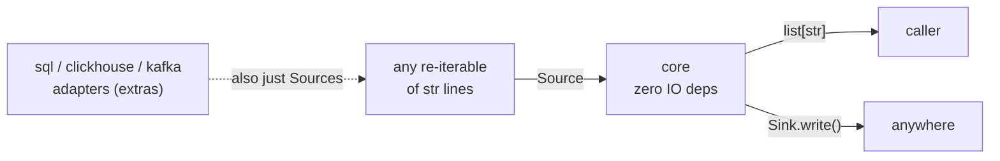

# logreducer architecture

Why the engine is shaped the way it is. The README covers what it does and how to
drive it -- this page is the reasoning and the invariants a caller cannot infer
from the API.

## The problem

You have gigabytes of logs and a question. Reading all of it is not an option,
and a random sample is worse than it sounds: random throws away the rare lines,
which are usually the interesting ones, and keeps thousands of copies of the line
that repeats. What a reader actually wants is one of each SHAPE, plus the
outliers.

Two constraints make that harder than picking a sample.

- The input does not fit in memory, and neither does the set of UNIQUE lines. A
  10 GB log with 40 million distinct lines will not fit either way, so the engine
  must hold neither.
- Some reduction modes need more than one look at the data, and the data might be
  a database query or a Kafka topic rather than a file.

## The shape: a reduction engine behind two protocols

The core does no IO at all. Input is a `Source` -- anything whose `__iter__`
yields `str` and can be iterated more than once. Output is a `Sink` --
`write(lines) -> int`. Those two structural protocols are the whole integration
surface.

They are protocols rather than base classes on purpose. A `list[str]` is already
a `Source`, and an application's own object becomes one without importing
anything from here.

The point of that boundary is ownership. The engine never manages a connection,
so there is nothing for it to leak, nothing for it to time out, and no
credential inside it. The adapters that DO own connections -- SQLAlchemy,
clickhouse-connect, confluent-kafka -- sit behind optional extras, and the core
never imports them.

## Re-iterability is the load that protocol carries

`reduce()` counts lines in one pass to compute the reduction ratio, then re-reads
the source to process it. Hybrid mode reads it a third time. So `__iter__` has to
return a FRESH iterator every call.

A bare generator satisfies the type and breaks the contract, and the failure is
silent in the worst way -- the counting pass drains it and the processing pass
finds nothing, so the result is an empty list rather than an error. That is why
`reduce()` tests `iter(source) is source` and raises `TypeError` up front.

The same requirement shapes every adapter. `SQLSource` re-runs its query per
pass. `KafkaSource` re-reads from the earliest offset and never commits.
`FileSource` re-opens the file and streams it again. A seeded sample is required
for the same reason: an unseeded one would hand pass two a different set of rows
than pass one, and the reducer would be comparing two populations.

## What streams, and what cannot

Pattern and temporal modes stream end to end. Exact dedup, optional fuzzy dedup
and Drain3 mining run as one generator pipeline, so the unique-line set is never
collected into a list. Peak memory is the bounded dedup cache plus the Drain3
template store, and neither grows with the number of unique lines the source has.

Anomaly mode cannot stream. Isolation Forest over a TF-IDF matrix is batch ML and
needs its rows at once. That is the one place a hard memory ceiling needs an
explicit sample, which is exactly what `anomaly_max_rows` is -- a reservoir cap
with a fixed seed, trading anomaly recall for a bounded matrix, and off unless
asked for.

So picking a mode is also picking a memory shape. Worth knowing before reaching
for the tuning knobs.

## Collecting a target instead of reducing everything

`reduce_to_target` is a different loop for a different question: about N
representative lines, rather than all of the input reduced. It pulls fresh random
batches, reduces each, and accumulates distinct representatives until one of five
stop conditions fires -- target, exhausted, max_fetches, plateau, or memory.
Batch size is resized from the observed average row bytes, so peak memory stays
around one batch plus the accumulator.

The stop reason is reported rather than hidden, because "plateau" and "target"
mean very different things about the answer you are holding.

## Determinism

Every sample in the engine is seeded. The anomaly reservoir and the
normal-context sample both use a fixed seed, and SQL sampling takes an explicit
`sample_seed`.

That is not a security property, and there is no security requirement in picking
log lines. It is a correctness property the multi-pass design depends on: pass
two has to see what pass one saw.

It is also why SQLite raises `SamplingNotSupported` for a seeded sample instead
of quietly giving an unseeded one. SQLite has no seedable RNG, so it cannot keep
the promise, and pretending otherwise would produce a result that looks
reproducible and is not.

## Embedding in a host application

Three seams, none of which needs the library to know anything about the host.

| Seam | How |
|---|---|
| Config | Build a `BigDialConfig` from the host's own cascade and inject it, or call `BigDialConfig.from_env(prefix, fallback)` where the prefixed name beats the bare one. Keyword arguments still win on top |
| Logging | Off by default. `own_sinks=False` registers nothing, so records flow through the host's handlers formatted by the host's standard |
| IO | The `Source` and `Sink` protocols above |

## Invariants

1. **`__iter__` returns a fresh iterator.** Checked at the entry point, not
   documented and hoped for.
2. **The core imports no IO library.** An adapter's dependency is an extra, and
   the core never imports the adapter modules.
3. **Analysis state is per run.** `_reset_components()` rebuilds the dedup
   seen-set, both Drain3 miners and the fuzzy LSH, so one `LogReducer` is
   reusable across calls and hybrid's two passes cannot poison each other.
   Without it every line reads as already-seen and the result is empty.
4. **An unknown config keyword raises.** A silently dropped override is tuning
   that quietly does nothing, which is worse than a failure.
5. **The row-to-line convention is shared.** The database adapters take the FIRST
   column, skip NULLs and skip blank lines, matching `FileSource`, so the same
   data reduces identically whichever source carried it.
6. **Every sample is seeded.** See above.
7. **Config enums serialise as their `.value`**, so metadata survives
   `json.dumps` and no `OutputFormat.LINE`-style repr leaks into output.
8. **A memory ceiling above 70% of available RAM is clamped with a warning**
   rather than accepted.

### Where the numbers are approximate

`input_lines` and the reduction ratio come from the counting pass over the
source. A size-sampled `FileSource` yields its SAMPLED line count, so on a very
large file both figures describe the sample rather than the file. Say which when
quoting them.

`estimate_processing` is a size-based estimate and nothing more -- it reads the
file size and the chosen read strategy, and does not look at the content.
